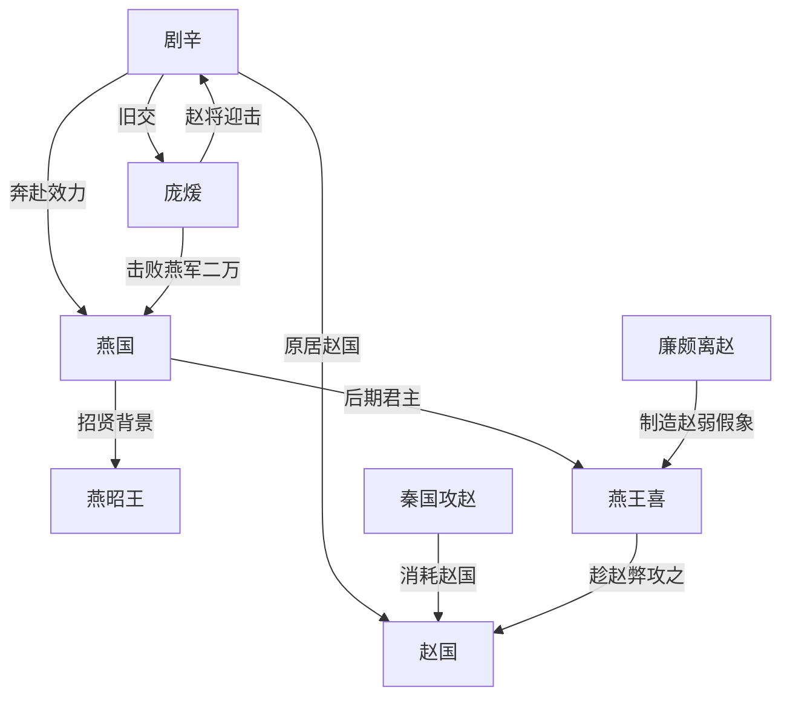

# 剧辛：一句轻敌的话，送走了燕国最后的机会

燕军出发那天，北方的风应该很硬。

蓟城的宫门外，车轴碾过冻土，甲片在寒光里轻轻相撞。士兵们以为自己要去捡一场便宜仗：赵国刚被秦国反复撕咬，老将廉颇已经离开，国内疲惫，边境空虚。

更让燕王放心的是，领兵的人叫剧辛。

他不是普通将领。

他曾经住在赵国，认识赵国新任主将庞煖。两人旧日相善，熟悉彼此的谈吐、脾气，甚至可能在同一盏昏黄的灯下谈过兵法，谈过天下。

燕王喜问他：庞煖这个人，能不能打？

剧辛只说了一句：“庞煖易与耳。”

大意是：庞煖，很容易对付。

这句话像一粒火星，落进了燕国朝堂里早已堆好的干草。很快，燕军开拔。更快的是，命运开始转向。

最后，庞煖击败燕军，取燕军二万，剧辛死在战场上。

一个曾经从赵国出走的人，最终死在赵国老友的手里。

真正可怕的不是战败。

而是战败之前，燕国所有人都相信：这一次，他们看准了机会。

## 一、从赵国走向燕国的人

剧辛，又称剧子、处子，是战国末期燕国人物。

他的一生，史书留下的字不多。可正是这些不多的字，把他推到了一个危险的位置：他不是凭空冒出的边将，而是燕昭王招贤时代的一部分。

那是燕国最渴望翻身的时期。

燕国在战国七雄里位置偏北，常常显得边远、寒冷、迟缓。南方的齐国富庶强大，西方的秦国像一头越来越近的巨兽，赵国夹在中间，骑兵锋利，军风强悍。

燕国要活下去，就不能只靠祖宗留下的土地。

它需要人才。

于是燕昭王筑黄金台，招纳天下士人。乐毅从魏国来，邹衍从齐国来，剧辛从赵国来。那一刻，燕国像一个受过羞辱的人，忽然咬紧牙关，要把天下的聪明人都请到自己身边。

剧辛就在这样的风声里进入燕国。

他带来的不只是谋略，还有赵国经验。

这很重要。

战国不是一个坐在地图前画线的时代。一个谋士或将领，若在别国待过，就等于带来了另一套朝堂记忆：谁与谁不合，哪位将军骄傲，哪座城池虚弱，哪条道路适合奇袭，哪种羞辱会让君王失去理智。

剧辛知道赵国。

也正因为他知道，燕王后来才会问他庞煖。

可历史最残酷的地方在于：一个人过去的经验，既可能成为武器，也可能成为陷阱。

## 二、燕昭王的黄金台，和燕国人的旧梦

要理解剧辛，必须先理解燕国人的心病。

燕国长期被强邻压迫，尤其与齐国、赵国之间，既有仇恨，也有恐惧。燕昭王时期，乐毅率五国联军伐齐，一度攻下齐国七十余城，只剩莒和即墨没有攻破。

那是燕国历史上少有的高光时刻。

燕国人第一次觉得：原来我们也能把大国按倒在地。

可是这场胜利没有真正变成稳固的帝国基础。乐毅后来受疑离燕，齐国田单反攻复国，燕国的辉煌像一场雪夜里的火，亮过，却没有烧久。

这段往事给燕国留下两种东西。

第一，是野心。

第二，是焦虑。

燕国知道自己曾经成功过，所以更难接受衰落；燕国也知道自己成功得太短，所以更害怕再次错过机会。

剧辛就是在这种政治空气里老去的。

他见过昭王求贤的雄心，也见过燕国胜利后的裂缝。他明白一件事：小国想改变命运，常常必须借大国之间的伤口下手。

于是到了燕王喜时期，当赵国被秦国不断打击，廉颇又离开赵国时，燕国朝堂终于闻到了血味。

他们以为赵国虚了。

这正是故事的第一个反转。

赵国确实受伤了。

但受伤的赵国，不等于可以任人宰割的赵国。

## 三、庞煖：旧友，敌将，最后的审判者

庞煖不是一个简单的“被轻视者”。

他是赵国末期的重要将领，也与兵家、纵横之学有联系。史书说剧辛故居赵，与庞煖善。这几个字很短，却藏着巨大的戏剧性。

“善”，不是普通认识。

它意味着两人曾经有交情，可能互相欣赏，至少不是陌生人。对剧辛来说，庞煖不是远方传闻里的赵将，而是一个他曾经近距离观察过的人。

正因如此，他才敢在燕王面前判断：庞煖容易对付。

可人的可怕，往往不在于你认识他，而在于你以为自己仍然认识他。

剧辛离开赵国之后，赵国变了。

秦国的压力越来越重，赵国的政治环境越来越紧，长平之战后的阴影仍在，廉颇出走又让赵国军心承压。一个国家在绝境中，会把幸存者磨得更硬。

庞煖也可能已经不是当年那个旧友。

他面对的不是一场普通战争，而是一场赵国必须证明自己仍有牙齿的战争。

燕国想趁赵国之弊。

赵国就必须让燕国明白：秦国能咬赵国，不代表燕国也能。

于是两个旧人站到了战场两边。

一个带着对过去的判断。

一个带着被轻视后的反击。

## 四、燕王喜的算盘

燕王喜为什么敢打？

原因看起来很充分。

赵国连年受秦国攻击，国力被消耗；名将廉颇离开赵国，军事支柱断裂；庞煖虽然接手军务，却不像廉颇那样拥有不可撼动的声望。

从燕国视角看，这是一扇突然打开的门。

小国最怕什么？

最怕永远没有机会。

当机会出现时，君王很难冷静。他会把所有有利迹象串成一条线：赵国疲惫，廉颇不在，庞煖可欺，燕军可进。

剧辛的话，正好补上最后一块砖。

这不是一个人的轻敌，而是一整个朝堂的愿望找到了出口。

剧辛说“庞煖易与耳”，燕王喜听到的可能不是一句军事评估，而是他最想听见的答案：

现在可以动手了。

这里藏着历史里反复出现的危险。

君王问臣子，不一定是在寻找真相。

有时是在寻找许可。

## 五、北方战场：一场便宜仗如何变成死亡陷阱

燕军南下时，可能并不觉得自己在冒险。

赵国的边境在寒风里显得疲惫。村落经过战争和征发，青壮被拉走，田地荒着，路边的草木被军马啃得凌乱。燕军士卒听着车轮声，也许以为再往前一点，就是赏赐、土地和功劳。

剧辛也许比他们更沉默。

他知道赵国。

越知道，越容易相信自己能从缝隙里穿过去。

可庞煖没有给他这个机会。

史书没有详细描写这场战役的过程，只留下结果：赵军迎击，取燕军二万，杀剧辛。

但这个结果本身已经足够冷。

二万，不是一个轻飘飘的数字。

那是两万个家庭的门闩在夜里被风吹响，是两万套盔甲散落泥中，是燕国朝堂上原本兴奋的声音突然安静下去。

更沉重的是剧辛之死。

他不是死于一个陌生敌人，而是死于自己判断“容易对付”的庞煖。

这一刻，过去的交情变成了最锋利的讽刺。

如果剧辛曾在赵国与庞煖并肩饮酒，那么战场上的每一声鼓，都像是在替过去送葬。

## 六、一句“易与耳”的代价

剧辛的悲剧，不只是他看错了庞煖。

更深一层，是他看错了局势。

赵国确实衰弱，却没有崩溃。廉颇出走，的确伤了赵国；但赵国仍有庞煖，后来还有李牧。秦国让赵国流血，可燕国的进攻反而给了赵国一个机会：用燕军的失败，向诸侯证明自己仍能作战。

谁从这场战争中受益？

赵国受益。

庞煖受益。

秦国也间接受益。

因为东方诸侯本该把注意力放在秦国身上，却还在彼此试探、彼此撕咬。燕国打赵国，赵国反击燕国，损耗的都是关东诸侯自己的血。

秦国最希望看到的，正是这种局面。

战国末年最深的悲哀就在这里：每个国家都知道秦国危险，但每个国家又都忍不住先算邻居的便宜。

剧辛的失败像一面镜子。

镜子里不是一个老将的昏聩，而是六国共同的病：他们总觉得还有时间，总觉得可以先从别人身上割下一块肉，再回头一起抵抗秦国。

可历史不会等他们排好顺序。

## 七、人物关系网

剧辛身边的关系并不复杂，却每一条都带着危险。

| 人物 | 与剧辛的关系 | 戏剧张力 |
| --- | --- | --- |
| 燕昭王 | 招贤时代的君主，剧辛入燕的重要背景 | 给了剧辛舞台，也给燕国留下复兴幻梦 |
| 燕王喜 | 后期燕国君主，任剧辛攻赵 | 需要一个胜利来证明燕国仍有机会 |
| 庞煖 | 剧辛在赵国时的旧交，后为敌将 | 旧友变成审判者，熟悉反而导致误判 |
| 廉颇 | 赵国名将，离赵成为燕国判断赵弱的重要原因 | 他的缺席让燕国误以为赵国无柱 |
| 乐毅 | 燕昭王时期名将，招贤时代代表人物 | 他的成功是燕国野心的旧影 |
| 李牧 | 赵国后期名将，代表赵国仍有军事生命力 | 说明赵国并未因廉颇离去而失去全部抵抗力 |
| 秦国 | 远处的最大压力 | 让赵国流血，也让燕国误判时机 |

## 八、时间线

| 时间 | 事件 | 影响 |
| --- | --- | --- |
| 燕昭王时期 | 燕国招贤，乐毅、邹衍、剧辛等士人入燕 | 燕国获得复兴人才，形成强烈进取心 |
| 燕昭王后期 | 燕国参与伐齐，曾一度取得巨大成果 | 燕国相信自己有能力改变强弱格局 |
| 燕王喜时期 | 赵国屡受秦国攻击，廉颇离赵 | 燕国判断赵国出现可乘之机 |
| 前242年左右 | 燕王喜询问剧辛对庞煖的判断 | 剧辛认为庞煖容易对付，推动燕国出兵 |
| 同年 | 剧辛率燕军攻赵，庞煖迎击 | 燕军大败，损失二万，剧辛被杀 |
| 战后 | 赵国证明仍有反击能力，燕国受挫 | 六国互耗继续加深，秦国战略压力更难抵挡 |

## 九、隐藏的历史链条

剧辛之败，看似只是燕赵之间的一场边境战争。

但它背后有一条更长的链条。

秦国不断进攻赵国，让赵国显得虚弱。

赵国虚弱的表象，诱使燕国出手。

燕国出手，反而被赵国击败。

赵国赢了燕国，却也继续被秦国压迫。

东方诸侯在彼此的伤口上寻找机会，最终让秦国获得更大的战略空间。

这就是剧辛故事里的蝴蝶效应：一句对旧友的轻蔑评价，并没有只害死一个将军，它还暴露了燕国的判断机制，消耗了燕国的兵力，也让六国抗秦的裂缝更深。

如果燕国没有攻赵，那两万燕军也许还能守边。

如果燕赵没有互相消耗，关东诸侯也许能更早意识到秦国才是真正的中心威胁。

但历史没有如果。

剧辛的死，像战国末年的一声短促叹息：人们都看见了远处的大火，却仍然低头抢邻人的粮仓。

## 十、剧辛的悲剧意义

剧辛不是战国最耀眼的人物。

他没有白起的杀伐，没有乐毅的恢宏，没有李牧的孤绝，也没有廉颇那种老将传奇。

可他身上有一种更普通、更真实的悲剧。

他曾经站对过风口。

燕昭王招贤时，他从赵国来到燕国，成为小国求强的一部分。他也许见过黄金台的光，见过燕国朝堂重新燃起希望。那时的剧辛，是燕国复兴故事里的参与者。

但到了晚年，他又成了燕国误判的执行者。

一个人的经验，原本应该让他更谨慎；可剧辛的经验却让他更笃定。

他认识庞煖，所以低估庞煖。

他熟悉赵国，所以误判赵国。

他渴望替燕国抓住机会，所以没有看清机会下面的刀。

这就是剧辛最扣人心弦的地方。

他不是无知而败。

他是因为“知道”而败。

## 十一、结尾：旧友举兵时，历史已经沉默

我们可以想象最后的场景。

暮色压低，战场上尘土混着血腥味。燕军旗帜倒伏，马匹嘶鸣，士兵在混乱中寻找主将的方向。

远处，赵军鼓声越来越近。

剧辛也许终于明白，自己错在哪里。

庞煖不是容易对付的人。

赵国也不是可以随手撕开的破布。

更重要的是，燕国把一次国家级冒险，押在了一个人对旧友的旧判断上。

当庞煖的军队压上来时，剧辛面对的不只是赵军。

他面对的是自己说过的话。

“庞煖易与耳。”

这句话在朝堂上听起来轻巧。

到了战场上，却重得足以压垮两万燕军。

剧辛死后，燕国没有因此清醒太久。战国的车轮继续向前，秦国的阴影越来越大，燕赵之间的仇怨仍未停止。后来燕太子丹派荆轲刺秦，已经是另一种绝望。

从黄金台招贤，到剧辛兵败，再到荆轲入秦，燕国的故事像一条越拉越紧的弦。

剧辛只是其中一声断响。

但这声断响告诉后人：在乱世里，最危险的判断，往往不是“不知道”。

而是太相信自己知道。

## 史料依据与创作说明

- 《史记·燕召公世家》记载：乐毅、邹衍、剧辛等人奔赴燕国；又记剧辛故居赵，与庞煖相善，后燕王喜因赵国受秦困扰、廉颇离去而攻赵，剧辛称庞煖“易与耳”，最终庞煖击败燕军，取燕军二万，杀剧辛。
- 《史记·赵世家》记载赵悼襄王三年，庞煖攻燕，擒其将剧辛。
- 《汉书·艺文志》著录《处子》九篇，后世有观点认为“处子”与剧辛相关。
- 本文将史书记载作为事实骨架；战场气氛、心理活动、宫廷场景为叙事化再现，用于增强可读性，并非逐字史实记录。
