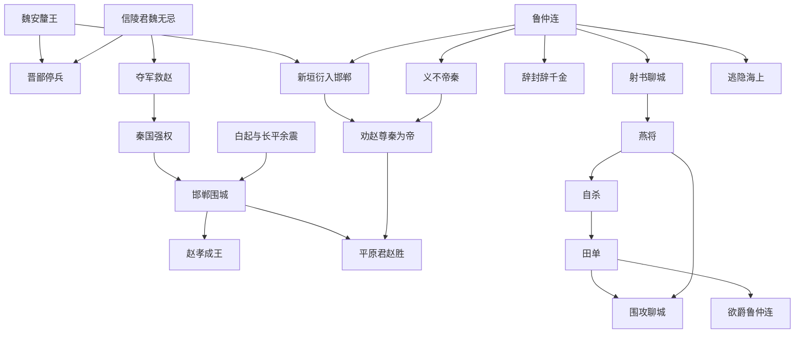

# 鲁仲连：那个拒绝做官的人，怎样用一句话逼退帝国的阴影

邯郸被围的日子里，空气里大概有烧木、汗水和恐惧混在一起的味道。

城外是秦军。长平的尸骨还没有真正冷下去，赵国已经又被推到城墙边。粮车进不来，救兵不敢动，贵族们在密室里压低声音，像在等一盏灯慢慢熄灭。

就在这时，一个来自齐国、没有官职、没有军队、也不愿接受封赏的人走进了风暴中心。

他叫鲁仲连。

他不是王侯，不是将军，也不是纵横家里那种靠一张嘴换取富贵的人。史书给他的第一笔很锋利：齐人，喜欢奇伟的谋略，却不肯做官，爱持高节。

这句话听起来像赞美。

可放在战国末年，它其实很危险。

因为那是一个所有人都在找靠山的时代。秦国靠军功，魏国靠旧霸权的残影，赵国靠最后的抵抗，齐国靠观望和恢复元气。游士们奔走列国，把口才卖给君王，把局势变成筹码。

鲁仲连偏偏不卖。

他要做的，是“排患释难解纷乱而无取”。替人解除危难，却不拿报酬。

问题是，一个什么都不想要的人，反而最难被收买，也最难被吓倒。

## 1. 危局：邯郸城里，最可怕的不是秦军

长平之战后，赵国被白起打断脊梁。几十万赵军覆灭，秦军趁势东进，围住邯郸。

赵孝成王恐惧，平原君赵胜焦灼，诸侯救兵在远处观望。魏安釐王派晋鄙救赵，却停在荡阴不敢前进。援军看似来了，实际上像一把插在鞘里的剑，既不拔出，也不能当作没有。

真正致命的转折来自魏国派来的客将军新垣衍。

他悄悄进入邯郸，给赵国献上一个听起来很现实的方案：尊秦昭王为帝。

他的逻辑很冷：秦围邯郸，不一定真想吞赵，只是想重新获得“帝”的名号。赵国如果主动承认秦为帝，秦王高兴，也许就退兵。

这不是投降。

这是把投降包成外交。

平原君犹豫了。因为这套话最可怕的地方，不在于它无耻，而在于它像一条活路。城中饥惧，城外铁骑，任何能让秦军退走的办法都会显得诱人。

可鲁仲连一眼看穿：一旦赵国承认秦为帝，问题就不再是邯郸一城，而是天下秩序彻底改写。

秦不再只是强国。

秦会变成合法的主人。

## 2. 人物：鲁仲连为什么不像普通说客

鲁仲连最特别的地方，是他没有固定的权力位置。

他是齐人，却游于赵。他能参与赵国危机，却不是赵臣。他能说动魏国客将，却不拿魏国俸禄。他能影响齐国田单攻聊城，却不接受齐国封赏。

这让他像一个游离在制度之外的人。

战国的游士通常有明确目标：求官、求爵、求富贵、求君王赏识。苏秦佩六国相印，张仪以连横取重于秦，范雎用仇恨和谋略登上秦相之位。

鲁仲连不同。

他不是没有能力进入权力场，而是拒绝被权力场收编。

这种拒绝并不等于清高地旁观。恰恰相反，他每次出现，都在最危险的裂缝里：一次是邯郸，一次是聊城。

他不做官，却干预国家生死。

他不收钱，却改变君王决策。

他不像隐士，因为隐士避世；也不像说客，因为说客逐利。鲁仲连更像战国末年的一种异类：把“士”的尊严放在“术”的锋芒之上。

## 3. 对手：新垣衍不是蠢人，他代表一种恐惧

新垣衍的主张很容易被后人骂成软弱。

但如果只把他看作胆小鬼，就低估了这场辩论的重量。

他代表的是六国末期一种普遍心理：秦太强了，硬碰会死，不如让出名分，换一点喘息。

这种想法不荒唐。它甚至很“务实”。

魏国害怕秦，所以晋鄙不进。赵国害怕亡国，所以平原君犹豫。诸侯害怕引火烧身，所以救兵不敢击秦。每个人都觉得自己只退一步，天下也许还能维持。

鲁仲连要打碎的正是这种心理。

他没有先谈忠义，而是先抓住新垣衍的切身恐惧。

他问：如果梁，也就是魏国，把秦当作主人，那么魏王还能安坐王位吗？魏国大臣还能保住宠信吗？

秦一旦称帝，就不是要一个虚名。它会改换诸侯大臣，安排自己喜欢的人，夺走各国宫廷中的人事权、婚姻权和政治权。

这是鲁仲连辩论中最狠的一层。

他把“尊秦为帝”从一个外交姿态，翻译成一幅私人灾难图：你的国君会被羞辱，你的地位会被夺走，你以为能靠讨好秦保命，最后可能连宠臣都做不成。

新垣衍终于明白，自己递出去的不是和平书，而是奴契。

## 4. 反转：一句“不忍为秦民”，背后是天下秩序

鲁仲连最有名的态度，是“义不帝秦”。

但这四个字不能简单理解成情绪化的反秦。

他反对秦称帝，是因为“帝”在当时不是普通称号。周天子虽衰，礼法虽旧，但它仍然象征天下名分的最后边界。诸侯可以争霸，可以称王，可以相互吞并，但如果秦以武力逼天下承认它为帝，六国就等于主动承认：暴力可以直接变成天命。

鲁仲连对秦的判断非常尖锐：秦弃礼义，重首功，以权势驱使士卒，把百姓当俘虏一般支配。

这不是单纯骂秦残暴。

这是指出秦国制度的核心：军功、法令、强制、集中动员。它确实高效，也确实可怕。

在秦国的逻辑里，人首先是国家机器的零件。鲁仲连不能接受的，是这种机器一旦取得“帝”的名义，就会把整个天下都变成同一种秩序。

所以他说，如果秦肆然为帝，自己宁可蹈东海而死，不忍为其民。

这句话的力量，不在于他真的要去跳海，而在于他把选择推到极限：你们想用一个名号换退兵，可这个名号一旦送出去，后面跟来的可能是所有人的身份、尊严和政治空间一起崩塌。

邯郸城里，秦军还没有攻进来。

但鲁仲连已经看见了另一种沦陷。

## 5. 结果：秦军退五十里，但真正出手的是关系网

新垣衍被说服后，起身再拜，承认自己先前低估了鲁仲连，表示不敢再提帝秦。

消息传到秦军那里，秦将退军五十里。

这时，另一个关键人物登场：魏公子无忌，也就是信陵君。他夺取晋鄙兵权，救赵击秦，秦军最终引退。

这说明鲁仲连不是单独“用嘴退秦”的神话人物。

他真正的作用，是在关键时刻切断一条危险路线：如果赵、魏内部接受帝秦，信陵君救赵的政治正当性会被削弱，魏军也更难真正投入战场。

鲁仲连没有替信陵君夺兵符，也没有替赵国守城。

但他先把“尊秦为帝”这条退路堵死了。

这就是历史里常见的隐秘作用：有些人不直接完成胜利，却阻止失败变成合法选择。

平原君事后想封赏鲁仲连，鲁仲连三次推辞。酒宴上，平原君又奉上千金祝寿。

鲁仲连笑了。

他说，天下之士可贵之处，在于替人排患解难而无所取；如果做了事就要拿报酬，那是商贾之事，他不忍为。

然后他离开平原君，终身不再相见。

这一走，比任何受封都更有力。

因为他把自己的形象从“功臣”变成了“高士”。

## 6. 聊城：一封射进城里的信，为什么让燕将自杀

二十多年后，鲁仲连又一次出现在齐国危局里。

燕将攻下聊城，后来被人向燕国进谗。燕将害怕回国被杀，只好据守聊城不归。齐国名将田单围攻一年多，士卒死伤很多，城仍不下。

鲁仲连没有带兵。

他写了一封信，绑在箭上，射进城中。

这封信不是单纯劝降，而是一场心理拆解。

他告诉燕将：你现在有三个名分都站不住。为一时怨愤困守聊城，让燕王失去臣子，不忠；死守到城破，却不能让齐人信服你的威名，不勇；功败名灭，后世无称，不智。

接着他又给燕将两条路：要么带着车甲回燕，保全功名；要么归齐受封，富贵久存。

鲁仲连最厉害的地方，是他不只逼人，他会替对方设计“还能活着下台”的台阶。

可是燕将的处境已经被撕开了。

回燕，怕被诛。降齐，怕受辱。继续守城，没有未来。

他读信后三日哭泣，最后说，与其让别人杀我，不如自杀。

于是燕将自刃，聊城大乱，田单攻下聊城。

田单回来后称赞鲁仲连，想给他爵位。鲁仲连又逃隐海上，说自己宁可贫贱而轻世肆志，也不愿因富贵而屈身于人。

邯郸一次，拒绝赵国封赏。

聊城一次，拒绝齐国爵位。

同样的选择重复两次，人物就不再只是姿态，而成了信念。

## 7. 人物关系网：鲁仲连站在谁与谁之间

鲁仲连的故事不是一个孤胆英雄故事，而是一张战国末期的压力网。

## 8. 蝴蝶效应：鲁仲连改变了什么

鲁仲连没有消灭秦国，也没有阻止秦统一天下。

但他改变了战国末期一个极关键的心理节点。

如果邯郸危局中，赵国真的尊秦为帝，那么六国抗秦就会提前失去一层名分。诸侯可以畏秦，可以败秦，可以被秦吞并，但若主动承认秦为“帝”，就等于承认秦的支配不是一时强弱，而是天下新秩序。

鲁仲连阻止的是这种心理投降。

更深一层看，他也让“士”这个群体留下另一种可能：不依附君王，也能介入天下；不接受封赏，也能获得历史记忆；不拥有军队，也能在关键时刻改变战场之外的局势。

这对后世文人影响很大。

李白尤其喜欢鲁仲连。他羡慕的不是鲁仲连的口才，而是那种功成不受赏、谈笑却能解纷的姿态。后世士人每当想象自己既能干预天下又不被权力污染时，鲁仲连就会被重新召唤出来。

这就是他的文化回声：他让“高士”不只是山林隐者，也可以是危城中的行动者。

